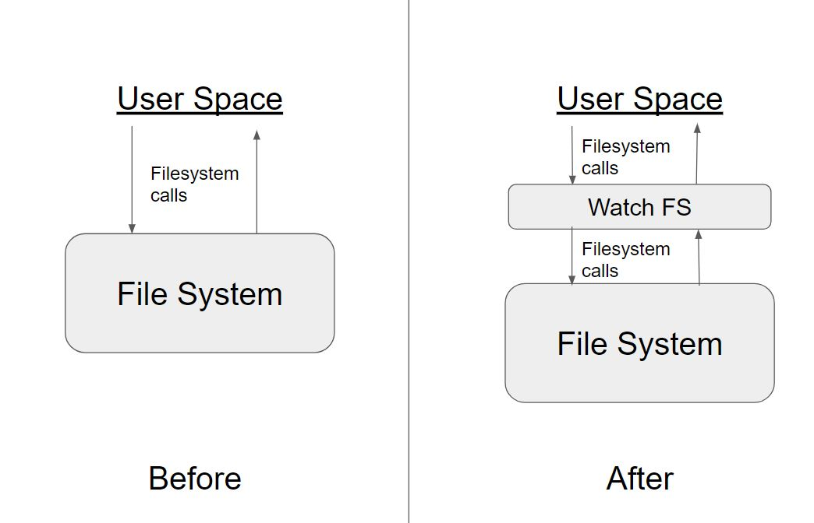
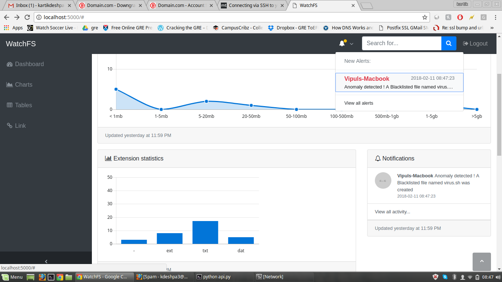
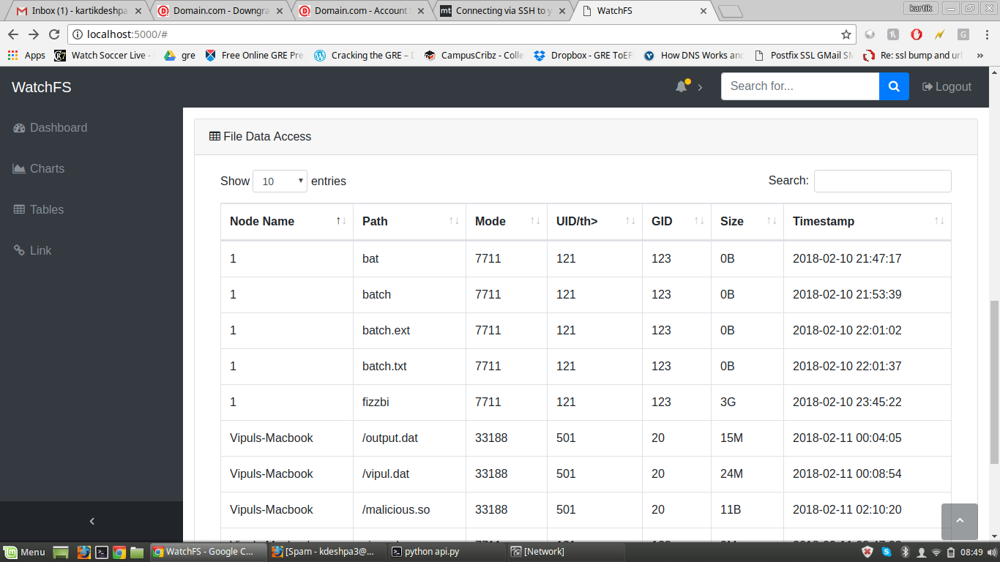

# WatchFS
Real-time Remotely Monitored File System.

---

WatchFS is a file system developed in FUSE (Filesystem in User Space). It records the activity happening on the File System
in real-time and sends it to a remote server via REST API. The server collects the data and displays the statistics to the user
via a dashboard.

---

### Disclaimer
This project was built in [HackBU 2018](https://devpost.com/software/watchfs) ( Hackathon at Binghamton university ) , in a span of 24 hours. and had won the first place as a best security hack project.

### Detailed description
WatchFS File System is mounted at any given path (mount point) on the user's machine. It then starts intercepting all the
filesystem calls happening over this mount point. Information from these filesystem calls (creating, deleting, writing a file,
etc.) is updated to a remote server via REST API. The filesystem call is then transparently sent to the underlying filesystem.
The remote server stores the aggregated information in a database. It provides a dashboard to the user where they can see the
statistics, charts and notifications about their filesystem.

### Features
* Completely transparent to the end user.
* Real-time remotely monitored.
* Multi-threaded and fault-tolerant client, so the REST API calls don't slow down/block the file system calls.
* Request queueing - for fault tolerance when the remote server is down.
* Real-time issuing of alert when malicious activity or malicious file is detected.
* Coded in Python and Flask framework. ( Yay! ) also had to use html/js/css for front end ( :( )

### Basic Working

---

### Real world Potential uses

1.Such a system can potentially be used to store sensitive stuff, such as classified documents. In such situations, it is essential that we monitor all the file system activity and notify the admin about any potetial security breaches or anomalous behavior in real-time.

2.In case of "work from home" permits, organization don't want their provided laptops to be misused.In such cases WatchFs can be mounted on the system to keep track of activites performed on the particular system.

3.In case of Off Shore Developement center(ODC) or even on On shore developement center, machines provied by organisation for office purpose can use this application to keep track of activites on that particular machine

---

### Screenshots

---

### Authors
- [Kartik Deshpande](https://www.linkedin.com/in/kartik-deshpande/)
- [Vipul Chaskar](https://www.linkedin.com/in/vipul-chaskar-50808757/)
- [Sujoy Das](https://www.linkedin.com/in/sujoydas27/)
- [Nikhil Raverkar](https://www.linkedin.com/in/raverkar-nikhil/)
